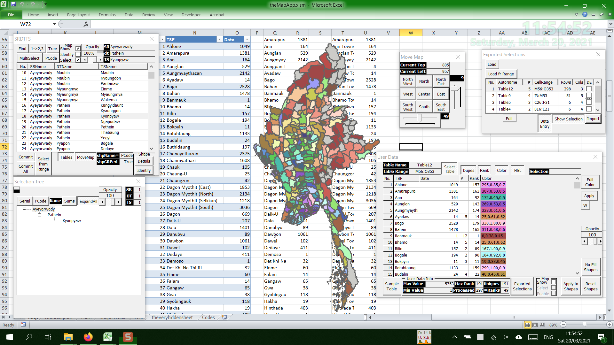
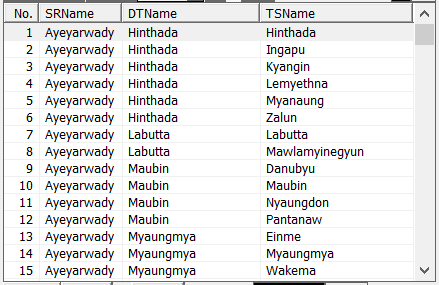
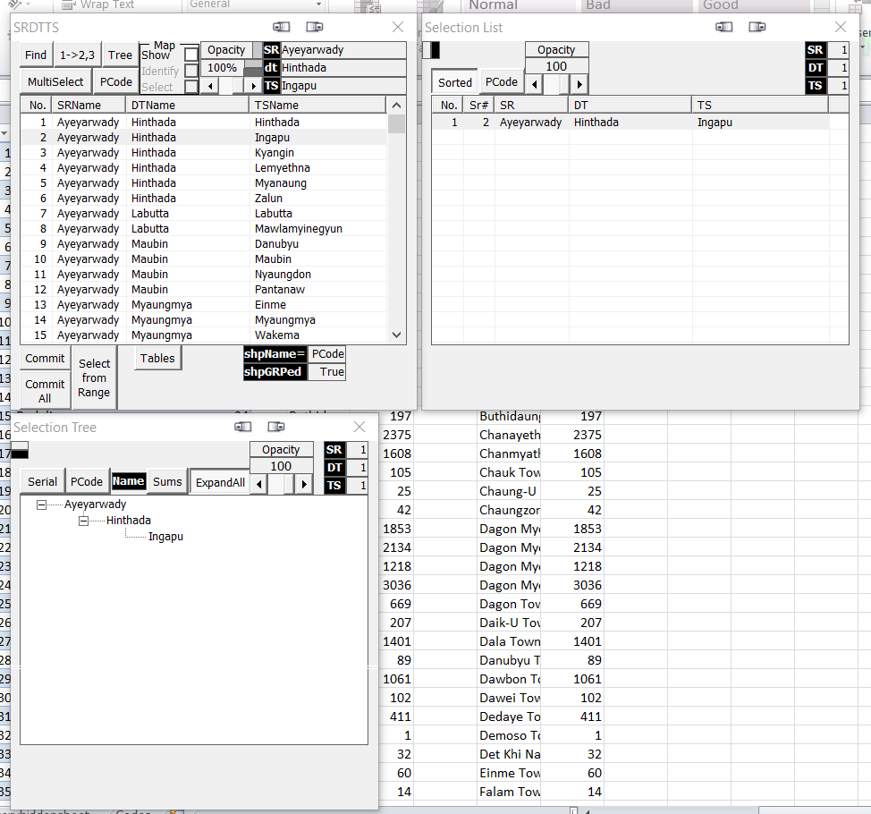
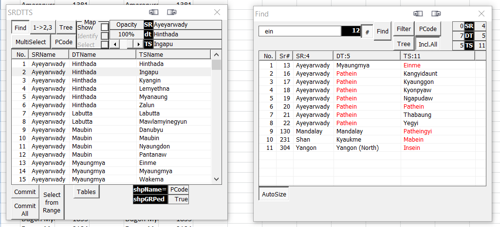
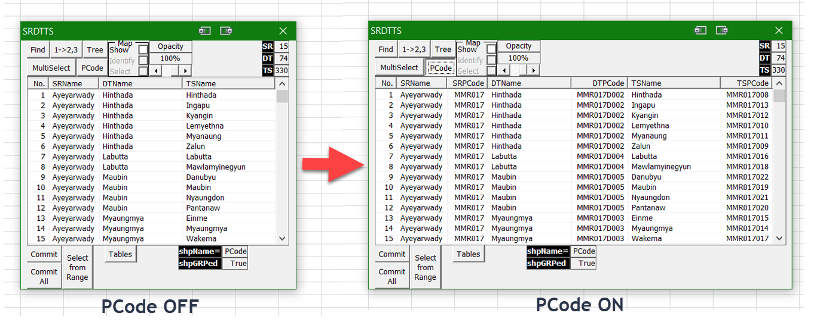
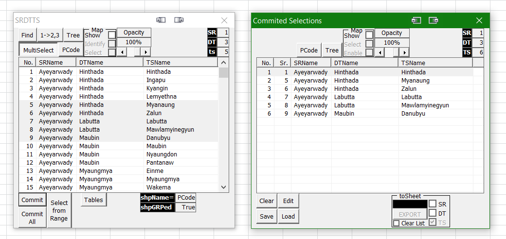
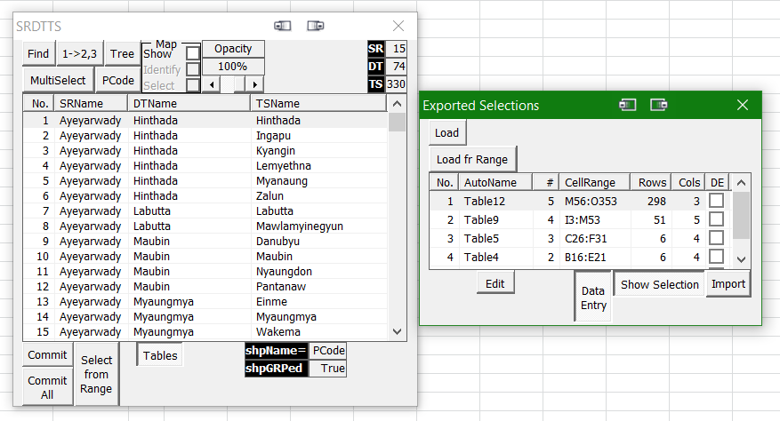

# Choropleth-Map-of-Myanmar
I am sorry to announce here that this project is not really ready to be released yet. 
The information herein provided is just to make myself clear so that I can come and read this to understand and help myself when I got a chance to pick this up again. 
**One day, when I am free enough and can get a chance to review the code I wrote regarding this project, I will finish this and release it.** 
For now, please kindly understand that this repo is just a show-and-tell of this tool's capabilities. 

## A Choropleth Map of Myanmar in Excel using VBA
Since I resigned from my job in 2015, I started working on this map project. 
But after some time working on it, like 3/4 months, either I got bored or some other interesting idea comes up and I move on to other projects. 
And then after like a year of exploring other fields like electronics, photography, etc., I always come back to this project. 
The issue then is that, every time, I return back to this project, I can't remember where I left off or what methods, functions and data structures were used anymore. 
And I am always forced to restart from scratch. 
That is the reason I wrote the VBA Project Info.  
This time around, I really thought that I am going to reach to a state where I can actually release this pet project as a workable tool. 
But then, there were many obstacles which popped up like the moles in a Whac-A-Mole game, first, COVID-19, then Myanmar Coup starting from 01FEB2021. 
And nearing the finalization of this map project, I got sidetracked into VBA Project Info tool. 
I am so into VBA Project Info tool now that, I totally lost track of everything in this map project. 
Fortunately, after somewhere between 3 or 4 attempts to re-jump-start this project over the last 6 years, I finally have some understanding of
how I should do it better with each iteration. 
With each restarted version, I added more and more functions and understand how to write better code and more userfriendly functions,
which would enhance user experience many folds compared to the very first version of this map project. 
 
 

### Choropleth Maps
Choropleth maps are different from heat (sisarithmic) maps in that the former uses pre-existing geographically defined areas to show data patterns while the latter just uses regions drawn according to the patterns of the variables... 

### Different UserForm Windows
I am very fascinated by UserForms in VBA so I like to use UserForms whenever possible. 
However, this leads to myriads of windows in this project. 
Even though I will only include the bare essentials in the release version, I will try to explain the function of each window for my own clarity and for posterity's sake. 
From here on out, UserForm and Window will be used interchangeably, for my own ease of use. 

#### 1. SRDTTS
##### 1.1. Basic Information
Currently, this window can be called up called up using the shortcut key F12. 
Main function: is to list all 330 townships under their own respective Districts under each State/Division in Myanmar. 
Other functions: will be explained under the explanation for each control. 
 

##### 1.2. List of Controls:
###### 1.2.1. ListView
 
This Listview shows all 330 townships under each districts where those townships belong and also each states/division each district belongs to respectively. 
The number of townships is only correct as far as 2020. Future increase or decrease in numbers or inclusion of sub-townships/towns may or may not reflect current changes. 
Selecting a listitem triggers automatic opening of 2 windows:
  - 1 showing a listview of currently selected listitem(s) and  
  - 1 showing a treeview the hierarchical view of currently selected listitem(s). 
The option to turn on/off this auto-opening windows and/or selecting which window to open may be included in the release version. 

 
Information on these windows shall be explained further under their own sections. 
###### 1.2.2. ToggleButton - Find
Find button is meant to be used for finding the name of a township/distrcit/state/region names. But it will also show PCode values if PCode is set to visible and if matched with find keyword. 
Initially and if there is no keyword in the Find textbox and if the AutoSize togglebutton is set to True, the Find window will be smallest. 
But it will grow to a certain set size with each increase in keyword length as it was typed and matched. Apparently that behaviour can be suppressed. 
Further information shall be explained in more detail in their own respective section.
 
###### 1.2.3 ToggleButton - 1->2,3
I know that this button caption is cryptic at it's best. But bear with me because choosing button names is harder for me than writing code. 
What this button does, when turned ON, is, it causes the MultiSelect button to be turned ON but Disabled/greyed-out. 
And then,, clicking/selecting a listitem (SRName/DTName) will select all the listsubitems below it. 
###### 1.2.4 ToggleButton - MultiSelect
The function of this button, is, it will turn ON/OFF the ListView's multiselect option using Ctrl+Click or Shift+Click. 
###### 1.2.5 ToggleButton - PCode

This button is meant for showing or hiding PCodes associated with each State/Region (SR), District (DT) or Township (TS). 
PCodes are place codes maintained and used by Myanmar Information Management Unit (MIMU). 
When I started coding this project, I thought they are important and necessary as Unique Primary Keys, 
however, in the ?4th iteration/incarnation of this project, I realized that this is not true. 
And I will probably stop using them if I ever have to rewrite the code later. 
The window does not actually increase in height but increased in width only. The image-editor I used just distort photos when 2 photos were merged this way. 
###### 1.2.6 CommandButton - Commit

In the photo, there are 5 listitems selected but in the Committed Selections window, there are 6 listitems because the first item was already committed before selecting 5 listitems. 
The Commit button was so named, like I said before, for the lack of a better name, at the time of coding. 
In a sense, it commits what's selected in the listview to a new collection (not VBA collection). 
It opens a new window showing committed selections which shows all selected items from the listview, which can be further processed as desired. 
Further info on Committed Selections window shall be discussed in their own section. 
###### 1.2.7 CommandButton - CommitAll
This button simply commit all 330 townships (in other words, the whole country) into Committed Selection Window for further processing. 
###### 1.2.8 CommandButton - Select from Range
This button was meant to allow selection of listitems in the listview based on a selection made on a worksheet range. 
It is similar to Load fr Range button on Exported Selections window but only for selection purposes, however, it is currently not yet implemented. 
###### 1.2.9 ToggleButton - Tables

This buttons was named as Tables because it shows the list of the Tables in the WorkSheet Ranges that were exported from _[Committed Selections](https://github.com/NLYinMaung/Choropleth-Map-of-Myanmar#126-commandbutton---commit)_ window. 
