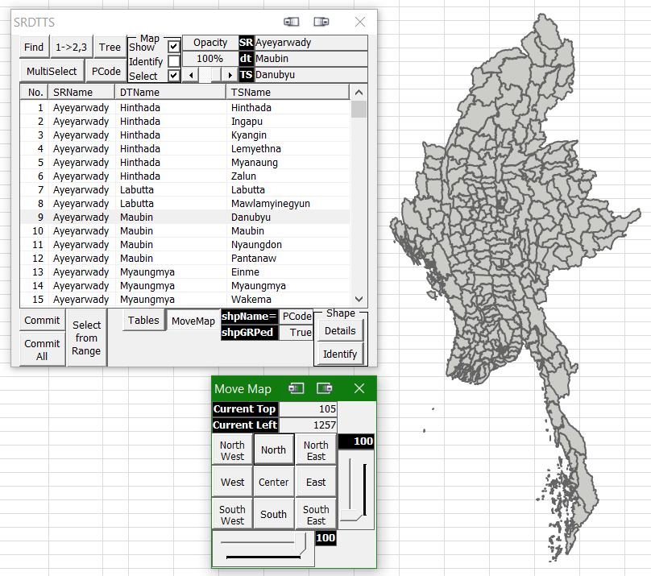
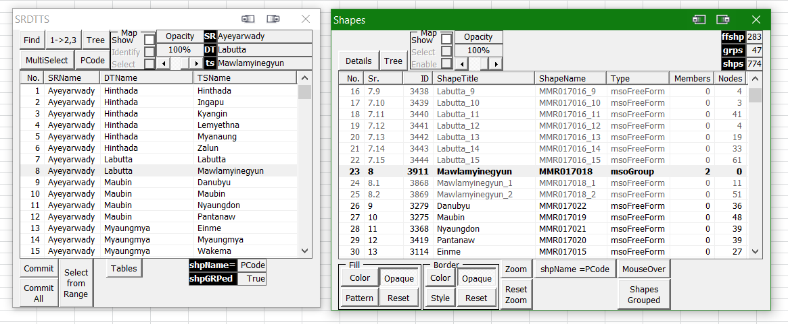
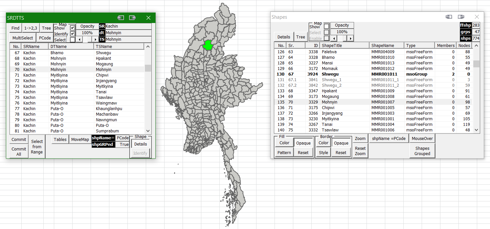
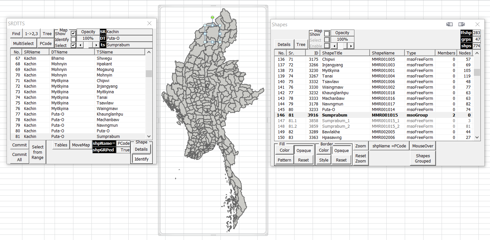
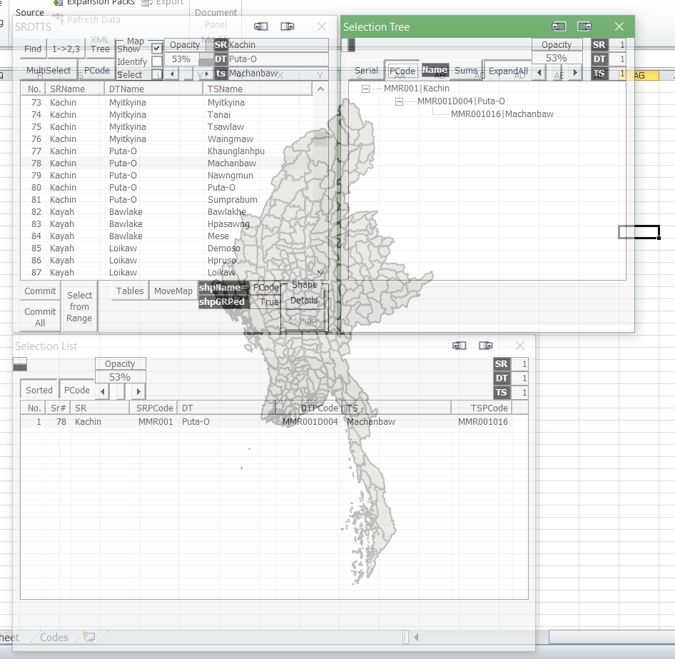

# Choropleth-Map-of-Myanmar
I am sorry to announce here that this project is not really ready to be released yet. 
The information herein provided is just to make myself clear so that I can come and read this to understand and help myself when I got a chance to pick this up again. 
**One day, when I am free enough and can get a chance to review the code I wrote regarding this project, I will finish this and release it.** 
For now, please kindly understand that this repo is just a show-and-tell of this tool's capabilities. 

## A Choropleth Map of Myanmar in Excel using VBA
Since I resigned from my job in 2015, I started working on this map project. 
But after some time working on it, like 3/4 months, either I got bored or some other interesting idea comes up and I move on to other projects. 
And then after like a year of exploring other fields like electronics, photography, etc., I always come back to this project. 
The issue then is that, every time, I return back to this project, I can't remember where I left off or what methods, functions and data structures were used anymore. 
And I am always forced to restart from scratch. 
That is the reason I wrote the VBA Project Info.  
This time around, I really thought that I am going to reach to a state where I can actually release this pet project as a workable tool. 
But then, there were many obstacles which popped up like the moles in a Whac-A-Mole game, first, COVID-19, then Myanmar Coup starting from 01FEB2021. 
And nearing the finalization of this map project, I got sidetracked into VBA Project Info tool. 
I am so into VBA Project Info tool now that, I totally lost track of everything in this map project. 
Fortunately, after somewhere between 3 or 4 attempts to re-jump-start this project over the last 6 years, I finally have some understanding of
how I should do it better with each iteration. 
With each restarted version, I added more and more functions and understand how to write better code and more userfriendly functions,
which would enhance user experience many folds compared to the very first version of this map project. 
 
 

### Choropleth Maps
Choropleth maps are different from heat (sisarithmic) maps in that the former uses pre-existing geographically defined areas to show data patterns while the latter just uses regions drawn according to the patterns of the variables... 

### Different UserForm Windows
I am very fascinated by UserForms in VBA so I like to use UserForms whenever possible. 
However, this leads to myriads of windows in this project. 
Even though I will only include the bare essentials in the release version, I will try to explain the function of each window for my own clarity and for posterity's sake. 
From here on out, UserForm and Window will be used interchangeably, for my own ease of use. 

#### 1. SRDTTS
##### 1.1. Basic Information
Currently, this window can be called up called up using the shortcut key F12. 
Main function: is to list all 330 townships under their own respective Districts under each State/Division in Myanmar. 
Other functions: will be explained under the explanation for each control. 
 

##### 1.2. List of Controls:
###### 1.2.1. ListView
 
This Listview shows all 330 townships under each districts where those townships belong and also each states/division each district belongs to respectively. 
The number of townships is only correct as far as 2020. Future increase or decrease in numbers or inclusion of sub-townships/towns may or may not reflect current changes. 
Selecting a listitem triggers automatic opening of 2 windows:
  - 1 showing a listview of currently selected listitem(s) and 
  - 1 showing a treeview the hierarchical view of currently selected listitem(s).

Both these windows are sticky to the _SRDTTS_ window and will go with it to any location and can switch each other's place between the two. 
The option to turn on/off this auto-opening windows and/or selecting which window to open may be included in the release version. 

Once the 2 _Selected Items_ windows are visible, 1 special clickable label will appear between _Opacity_ label and _SR_ label and 2 between _Opacity Percent_ and _DT_ labels. 
The first one allows transfer of _Opacity_ settings to _Selected Items_ window on the right. 
The middle one allows transfer of _Opacity_ settings to _Selected Items_ window at the bottom. 
The last one will change color to indicate that it is active or not and will transfer _Opacity_ settings to both the other windows at the same time. 

Information on these windows shall be explained further under their own sections. 
###### 1.2.2. ToggleButton - Find
Find button is meant to be used for finding the name of a township/distrcit/state/region names. But it will also show PCode values if PCode is set to visible and if matched with find keyword. 
Initially and if there is no keyword in the Find textbox and if the AutoSize togglebutton is set to True, the Find window will be smallest. 
But it will grow to a certain set size with each increase in keyword length as it was typed and matched. Apparently that behaviour can be suppressed. 
Further information shall be explained in more detail in their own respective section.

###### 1.2.3 ToggleButton - 1->2,3
I know that this button caption is cryptic at it's best. But bear with me because choosing button names is harder for me than writing code. 
What this button does, when turned ON, is, it causes the MultiSelect button to be turned ON but Disabled/greyed-out. 
And then,, clicking/selecting a listitem (SRName/DTName) will select all the listsubitems below it. 
###### 1.2.4 ToggleButton - MultiSelect
The function of this button, is, it will turn ON/OFF the ListView's multiselect option using Ctrl+Click or Shift+Click. 
###### 1.2.5 ToggleButton - PCode

This button is meant for showing or hiding PCodes associated with each State/Region (SR), District (DT) or Township (TS). 
PCodes are place codes maintained and used by Myanmar Information Management Unit (MIMU). 
When I started coding this project, I thought they are important and necessary as Unique Primary Keys, 
however, in the ?4th iteration/incarnation of this project, I realized that this is not true. 
And I will probably stop using them if I ever have to rewrite the code later. 
The window does not actually increase in height but increased in width only. The image-editor I used just distort photos when 2 photos were merged this way. 
###### 1.2.6 CommandButton - Commit

In the photo, there are 5 listitems selected but in the Committed Selections window, there are 6 listitems because the first item was already committed before selecting 5 listitems. 
The Commit button was so named, like I said before, for the lack of a better name, at the time of coding. 
In a sense, it commits what's selected in the listview to a new collection (not VBA collection). 
It opens a new window showing committed selections which shows all selected items from the listview, which can be further processed as desired. 
Further info on Committed Selections window shall be discussed in their own section. 
###### 1.2.7 CommandButton - CommitAll
This button simply commit all 330 townships (in other words, the whole country) into Committed Selection Window for further processing. 
###### 1.2.8 CommandButton - Select from Range
This button was meant to allow selection of listitems in the listview based on a selection made on a worksheet range. 
It is similar to _Load fr Range_ button on Exported Selections window but only for selection purposes without actually loading the WorkSheet range data into the Committed Selections window. At the time of writing this README.md, itt is not yet implemented. 
###### 1.2.9 ToggleButton - Tables

This buttons was named as Tables because it shows the list of the Tables in the WorkSheet Ranges that were exported from the EXPORT button under the frame _toSheet_ on _[Committed Selections](https://github.com/NLYinMaung/Choropleth-Map-of-Myanmar#126-commandbutton---commit)_ window. 
Further info on the Exported Selections window shall be presented in its own section. 
###### 1.2.10 Frame - Map
This frame was there for a place holder for the 3 CheckBoxes. 
1. Show
      Changes the visibility of the map. Also enables/disables the remaining 2 CheckBoxes. 
      Also changes the visibility of _MoveMap_ button and the frame _Shape_ containing _Details_ and _Identify_ buttons with the latter still disabled until the _Select_ CheckBox was checked. 
2. Identify
      Allows visual identification, of the clicked listitem in the listview, as represented by a green shape in the map. 
      It still does not allow direct selection of a shape using the mouse. 
3. Select
      Allows a single mapshape to be selected. 
      Also enables the _Identify_ Toggle Button. 
###### 1.2.11 ToggleButton - MoveMap

Not visible unless the _Show_ CheckBox under the frame _Map_ was checked. 
Shows the MoveMap window which can be used to move the Map window around the screen as the Map was locked down under normal user conditions to prevent accidental changes. 
Further info on MoveMap window will be available under its own section. 
###### 1.2.12 Frame - Shape
Only visible after the _Show_ CheckBox under the frame _Map_ was checked. 
Container for the ToggleButtons: 
1. Details
2. Identify
###### 1.2.13 ToggleButton - Details

Opens the Shapes Details window which contains detailed information about the msoFreeform/msoGroup shapes representing different townships. 
If and when _Details_ button is turned to ON state, detailed information of the shape corresponding to the selected listitem in the listview will get selected in Shapes Details window. 

If _Identify_ button is also turned ON when _Details_ was ON, the shape corresponding to the selected item in listview will be colored green and Shapes Details window will also show that shape's detailed information. 
###### 1.2.14 ToggleButton - Identify

Opens the Shapes Details window if not opened yet if and when a shape was selected on the map using mouse. 
This feature is different from the _Identify_ checkbox under the frame _Map_, in that this will allow selection of township shapes in the Map window. 
And if _Identify_ button were turned ON, the corresponding shape's detailed information will be selected in the Shapes Details window. 
###### 1.2.15 Label - Opacity
This is just a label acting as a label to identify the following label as Opacity Percent. 
Double-clicking on this label resets the _Opacity_ to 100%.
###### 1.2.16 Label - Opacity %
This label shows the current opacity % of _SRDTTS_ as set by the opacity slider below it. 
The _Opacity_ set here can be transferred to the _Selected Items_ listview and treeview. 
Double-clicking on this label resets the _Opacity_ to 100%.
###### 1.2.17 Slider - Opacity

Changes the opacity of the SRDTTS window and _Selected Items_ listview and treeview. 
Opacity, if set below 51% will cause Red color changes in the labels _Opacity_ and _Opacity%_ to warn the user and to aid in resetting it back to 100%. 
###### 1.2.18 Labels - SR/DT/TS and Corresponding 3 labels
These labels show how many townships/districts/state/regions were selected in the listview. 
Unless, _MultiSelect_ is turned on, they will show the names but once, _MultiSelect_ is ON, they will show only the counts of the selected townships/districts/state/region. 
