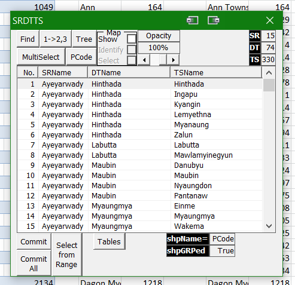

# Choropleth-Map-of-Myanmar
I am sorry to announce here that this project is not really ready to be released yet. 
The information herein provided is just to make myself clear so that I can come and read this to understand and help myself when I got a chance to pick this up again. 
**One day, when I am free enough and can get a chance to review the code I wrote regarding this project, I will finish this and release it.** 
For now, please kindly understand that this repo is just a show-and-tell of this tool's capabilities. 

## A Choropleth Map of Myanmar in Excel using VBA
Since I resigned from my job in 2015, I started working on this map project. 
But after some time working on it, like 3/4 months, either I got bored or some other interesting idea comes up and I move on to other projects. 
And then after like a year of exploring other fields like electronics, photography, etc., I always come back to this project. 
The issue then is that, every time, I return back to this project, I can't remember where I left off or what methods, functions and data structures were used anymore. 
And I am always forced to restart from scratch. 
That is the reason I wrote the VBA Project Info.  
This time around, I really thought that I am going to reach to a state where I can actually release this pet project as a workable tool. 
But then, there were many obstacles which popped up like the moles in a Whac-A-Mole game, first, COVID-19, then Myanmar Coup starting from 01FEB2021. 
And nearing the finalization of this map project, I got sidetracked into VBA Project Info tool. 
I am so into VBA Project Info tool now that, I totally lost track of everything in this map project. 
Fortunately, after somewhere between 3 or 4 attempts to re-jump-start this project over the last 6 years, I finally have some understanding of
how I should do it better with each iteration. 
With each restarted version, I added more and more functions and understand how to write better code and more userfriendly functions,
which would enhance user experience many folds compared to the very first version of this map project. 
 
 

### Choropleth Maps
Choropleth maps are different from heat (sisarithmic) maps in that the former uses pre-existing geographically defined areas to show data patterns while the latter just uses regions drawn according to the patterns of the variables... 

### Different UserForm Windows
I am very fascinated by UserForms in VBA so I like to use UserForms whenever possible. 
However, this leads to myriads of windows in this project. 
Even though I will only include the bare essentials in the release version, I will try to explain the function of each window for my own clarity and for posterity's sake. 
From here on out, UserForm and Window will be used interchangeably, for my own ease of use. 

#### 1. SRDTTS
##### 1.1. Basic Information
Currently, this window can be called up called up using the shortcut key F12. 
Main function: is to list all 330 townships under their own respective Districts under each State/Division in Myanmar. 
Other functions: will be explained under the explanation for each control. 
 

##### 1.2. List of Controls:
###### 1.2.1. ListView
 
This Listview shows all 330 townships under each districts where those townships belong and also each states/division each district belongs to respectively. 
The number of townships is only correct as far as 2020. Future increase or decrease in numbers or inclusion of sub-townships/towns may or may not reflect current changes. 
Selecting a listitem triggers automatic opening of 2 windows:
  - 1 showing a listview of currently selected listitem(s) and  
  - 1 showing a treeview the hierarchical view of currently selected listitem(s). 

